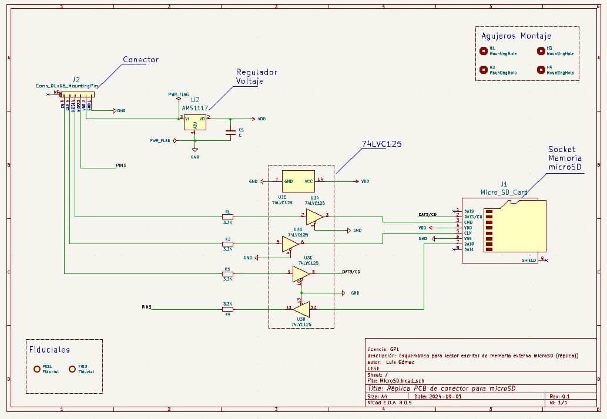
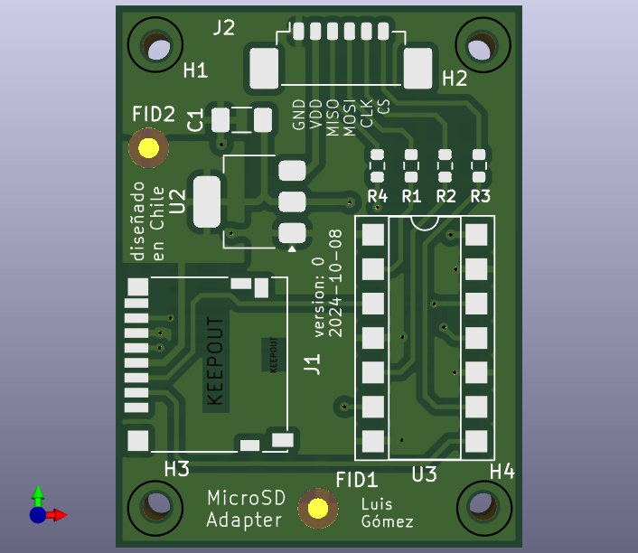
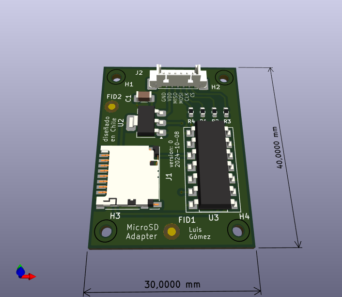

# Documentación Detallada: PCB Adaptador MicroSD

## 1. Información del Proyecto
- **Nombre del diseñador:** Luis Gómez
- **Email:** lgomez@patagones.cl
- **Nombre del proyecto:** Adaptador PCB MicroSD de Bajo Costo
- **Repositorio:** [https://github.com/cese-dci/tpf24a-cpatagon](https://github.com/cese-dci/tpf24a-cpatagon)
- **Versión:** 1.0
- **Fecha de última actualización:** 9 de octubre de 2024

## 2. Resumen Ejecutivo
Este proyecto consiste en el diseño de un adaptador PCB para tarjetas MicroSD, enfocado en proporcionar una solución de bajo costo y alta confiabilidad para aplicaciones embebidas. El diseño incorpora adaptación de niveles lógicos para compatibilidad con sistemas de 3.3V y 5V, utilizando componentes SMD para minimizar el tamaño y mejorar el rendimiento.

## 3. Notas de Ingeniería

### 3.1 Arquitectura del Diseño
- **Capas PCB:** Diseño de dos capas para equilibrar complejidad y costo.
- **Tecnología de componentes:** SMD exclusivamente, para reducción de tamaño y mejora de rendimiento en altas frecuencias.
- **Dimensiones del PCB:** 30mm x 20mm (optimizado para portabilidad).

### 3.2 Componentes Clave
1. **Buffer 74LVC125A:**
   - Función: Adaptación de niveles lógicos entre 5V y 3.3V.
   - Justificación: Permite la interoperabilidad con sistemas de diferentes voltajes.

2. **Regulador AMS1117:**
   - Función: Proporciona regulación estable de 3.3V para la tarjeta MicroSD.
   - Características: Baja caída de tensión, capacidad de corriente de 1A.

3. **Conector MicroSD:**
   - Tipo: Push-pull para fácil inserción y extracción.
   - Blindaje: Metálico para reducir EMI.

### 3.3 Consideraciones de Diseño
- **Integridad de la Señal:** Trazado de pistas críticas con impedancia controlada (90 ohms diferencial para líneas de datos SD).
- **EMI/EMC:** Implementación de planos de tierra en ambas capas para reducir interferencias. 
- **Térmica:** Área de cobre ampliada alrededor del regulador AMS1117 para mejorar la disipación térmica.

## 4. Notas de Aplicación

### 4.1 Casos de Uso Previstos
- Sistemas de registro de datos portátiles.
- Actualización de firmware en dispositivos embebidos.
- Almacenamiento expandible para proyectos de IoT.

### 4.2 Guía de Integración
1. **Conexión eléctrica:**
   - Pines de entrada: VCC (5V), GND, MOSI, MISO, SCK, CS.
   - Salida: Interfaz estándar MicroSD.

2. **Configuración de software:**
   - Compatible con bibliotecas estándar de SPI para MicroSD.
   - Ejemplo de código para Arduino y STM32 disponible en el repositorio.

### 4.3 Limitaciones y Precauciones
- Velocidad máxima de operación: 25 MHz (limitado por el buffer 74LVC125A).
- No compatible con el modo UHS-II de tarjetas SD de alta velocidad.

## 5. Estudios Previos y Estado del Arte

### 5.1 Análisis de Mercado
- Revisión de 10 adaptadores MicroSD comerciales (Adafruit, SparkFun, genéricos).
- Tendencia observada: Miniaturización y aumento de la velocidad de transferencia.

### 5.2 Avances Tecnológicos Relevantes
- Nuevos buffers de nivel lógico con menor consumo y mayor velocidad.
- Conectores MicroSD con mejor retención y durabilidad.

### 5.3 Estándares y Normativas
- Cumplimiento con especificaciones SD Association versión 7.0.
- Diseño ajustado a directrices de IPC-2221 para PCB.

## 6. Cálculos y Análisis

### 6.1 Análisis de Potencia
- Consumo estimado:
  - Buffer 74LVC125A: 8 mA (típico)
  - MicroSD (activa): 100 mA (máximo)
  - Regulador AMS1117 (pérdidas): 170 mW (típico con Vin=5V, Iout=100mA)
- Potencia total estimada: < 0.7 W

### 6.2 Análisis Térmico
- Temperatura máxima del regulador AMS1117:
  - Tj = Ta + (Pd * θja) = 25°C + (0.17W * 65°C/W) ≈ 36°C
  - Margen seguro, no requiere disipador adicional.

### 6.3 Cálculos de Ancho de Pista
- Pistas de señal (0.35 mm):
  - Capacidad de corriente: 0.5A a 10°C de elevación de temperatura.
- Pistas de alimentación (0.5 mm):
  - Capacidad de corriente: 1A a 10°C de elevación de temperatura.

### 6.4 Análisis de Integridad de Señal
- Simulación SPICE de líneas diferenciales SD:
  - Rise time: < 1 ns
  - Overshoot: < 10%

## 7. Diagramas y Visualizaciones

### 7.1 Esquemático General

*Figura 1: Esquemático completo del adaptador MicroSD*

### 7.2 Diagrama de Bloques Funcionales

*Figura 2: Diagrama de bloques funcionales del adaptador*

### 7.3 Diseño PCB

*Figura 3: Layout de PCB mostrando huellas de componentes*

### 7.4 Renderizado 3D

*Figura 4: Renderizado 3D del PCB ensamblado*

## 8. Presupuesto y Análisis de Costos

### 8.1 Costos de Fabricación (para 100 unidades)
- PCB (PCB Chile): $1.72 USD/unidad (https://pcb-chile.cl/quote)

### 8.2 Costos de Componentes (precios unitarios)
- 74LVC125A: $0.1 USD (https://www.mouser.cl/c/?q=74LVC125A )
- AMS1117: $0.0264 USD  (https://es.aliexpress.com/ )
- Conector MicroSD: $1.47 USD (https://www.mouser.cl/)
- Otros componentes pasivos: $0.50 USD

### 8.3 Costo Total Estimado
- Costo por unidad (incluyendo fabricación y componentes): $7.50 USD
- Precio de venta sugerido: $14.99 USD
- Margen bruto estimado: 50%

## 9. Conclusiones y Trabajo Futuro

### 9.1 Logros del Diseño Actual
- Adaptador MicroSD de bajo costo con adaptación de nivel lógico integrada.
- Tamaño compacto y diseño optimizado.

### 9.2 Áreas de Mejora
- Explorar la posibilidad de integrar RTC
- Investigar opciones para soportar velocidades UHS-I en futuras revisiones.

### 9.3 Próximos Pasos
- Fabricación de prototipo y pruebas de campo.

---

Este documento está sujeto a revisiones y actualizaciones. Última revisión: 09/10/2024.
