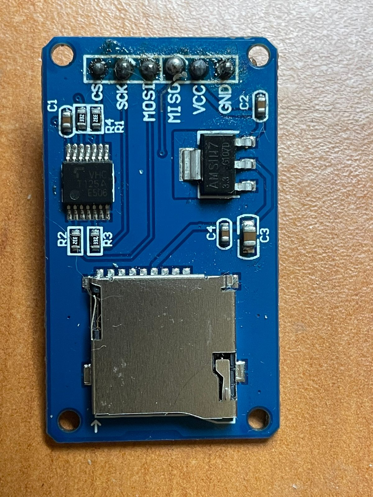
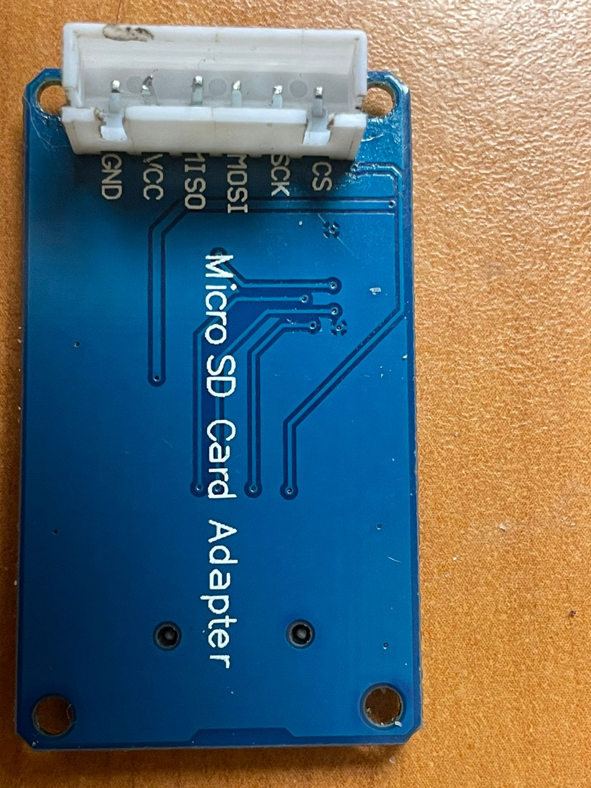
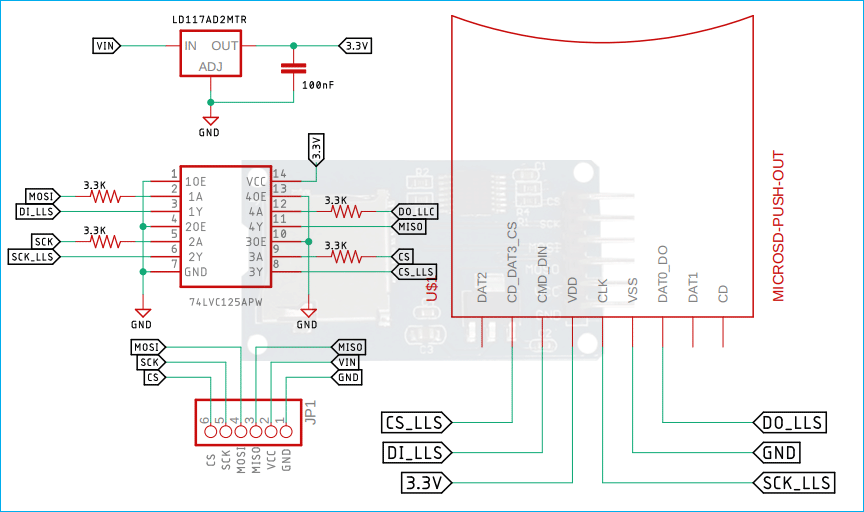

## Propuesta

En este directorio se incluye la información presentada al momento de acordar la propuesta del Trabajo Práctico con el docente. A continuación se detallan los elementos clave:

### Fotos e Imágenes

Si el trabajo es una réplica, se presentan las imágenes de las placas de ambos lados:

* **Placa MicroSD (Vista Superior):**  
  

* **Placa MicroSD (Vista Posterior):**  
  

### Circuito Esquemático de Referencia

A continuación, se incluye el esquema de referencia del circuito:

* **Esquemático del Módulo MicroSD:**  
  

### Documentación Técnica

Se incluyen los siguientes documentos técnicos relacionados con los componentes utilizados en el circuito:

* [AMS1117 - Datasheet](AMS1117.PDF)
* [SN74LVC125A - Datasheet](SN74LVC125A.PDF)

### Información Adicional

Si el trabajo es una tesis, a continuación se resumen las pruebas y prototipos realizados, así como el objetivo del circuito:

* **Resumen del Objetivo del Circuito:**  
  (Incluir aquí un resumen breve del objetivo o función principal del circuito, si es un trabajo de tesis)

* **Pruebas y Prototipos Cableados:**  
  (Incluir imágenes o descripciones de las pruebas realizadas)

### URLs o Información de Origen

Para mayor información y referencias, se incluyen los enlaces y recursos utilizados para definir el TP en el formulario de propuesta:

* **URLs e Información de Origen:**  
  (Incluir aquí las URLs o información relevante que se haya utilizado para la propuesta)

### Notas Adicionales

Cualquier otra nota o comentario que se haya utilizado para definir el TP en el formulario de propuesta se incluirá aquí.

