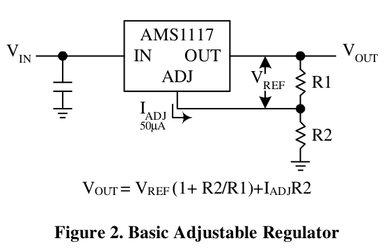
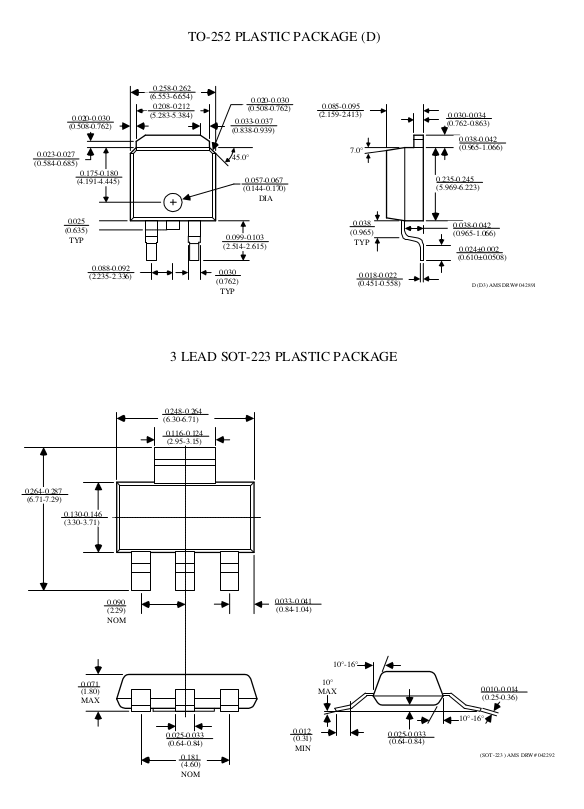

# Archivos Kicad ##

En este directorio debería ir:

## Archivos de proyecto.

### Gerber

Carpeta que contiene los Gerber del proyecto

[Enlace con archivos Gerber](Gerber)

## Esquemático y diagramas

### Esquemático general PCB

Representación completa del circuito de la PCB microSD, mostrando todas las conexiones y componentes principales, incluyendo el buffer 74LVC125A, el regulador AMS117, y el conector de la tarjeta microSD.

Plano  de la placa PCB diseñada se puede ver en la Figura 6 

**Figura 1:** Esquemático general de PCB de microSD para mas detalle ver  [link text](PDF/MicroSD.pdf)

### Integrado 74LVC125A
#### Diagrama

Buffer cuádruple de tres estados con entradas tolerantes a 5V. Contiene cuatro buffers independientes con salidas de tres estados, útil para adaptar niveles lógicos y aislar señales en sistemas digitales.

**Figura 2:** Diagrama lógico 74LVC125A 

#### Huella

Patrón de cobre en la PCB para soldar el chip 74LVC125A. Muestra la disposición de los pines y el área necesaria para el montaje del componente en la placa de circuito impreso.

**Figura 4:** Huella integrado 74LVC125A 

### Integrado AMS1117
#### Diagrama

Regulador de voltaje lineal de baja caída. Capaz de proporcionar hasta 1A de corriente de salida con un voltaje de salida ajustable o fijo, comúnmente usado para regular 5V a 3.3V.

**Figura 5:** Diagrama lógico AMS117 

#### Huella

Patrón de cobre en la PCB para el montaje del regulador AMS117. Muestra la disposición de los pines de entrada, salida y ajuste, así como el área de disipación térmica necesaria.

**Figura 5:** Huella AMS117

### Conector microSD

#### Huella 

Patrón de cobre en la PCB para el montaje el conector microSD. Muestra la disposición de los pines de entrada, salida y ajuste.

**Figura 6:** Huella conector micro SD

## PCB.

** Figura 2:** Gerber general con las principales huellas de la PCB

**Figura 6:** Plano  de la placa PCB microSD

[Carpeta PCB](MicroSD)

## Modelos  3D.

**Figura 7:** Huella Modelo 3D

Los distrintos patrones de cobre para soldar los componentes en la PCB se muestran en la figura 3

**Figura 3:** Huellas de los distintos componentes en la placa PCB de la microSD diseñada. Mas informacion visitar Gerber: [link text](Gerber/MicroSD-F_Mask.pdf)

**Figura 7:** Huella Modelo capa secundaria

## Bibliotecas de símbolos y huellas externas (si son necesarios).

[libreria](Libreria)

# PCB Design Checklist

## Información del Proyecto
- **Nombre del diseñador:** Luis Gómez
- **Email:** lgomez@patagones.cl
- **Nombre del proyecto:** PCB microSD
- **Repositorio o drive (url):** https://github.com/cese-dci/tpf24a-cpatagon
- **Esta revisión fue realizada por:** Luis Gómez
- **Fecha de la revisión:**9/10/2024
- **Fecha último commit:**  Wed Oct 9 19:16:56 2024 -0300 Colocar la fecha y hora del ultimo "git log" por ejemplo: Wed Aug 25 11:42:38 2021 -0300
- **Curso CESE - PCB:** DCI24A

## Resumen del PCB

| Característica | Valor |
|----------------|-------|
| Cantidad de capas | 2 |
| Terminación superficial | HASL con Plomo |
| Componentes de un lado o de ambos | Un lado |
| Componentes SMD, TH o mixto | SMD |
| Serigrafía de 1 o de 2 caras | 1 cara |
| Grillas que utilizó | 0,5, 0,25 y 0,1 |
| Valores de anchos de pistas que utilizó | 0,35 y 0,5 |
| Vías/agujeros que utilizó | 0,7/0,3 |
| Clearance (configurado en DRC para regla default) | Sin errores |
| Fabricante| PCB Chile https://pcb-chile.cl/|

## Documentación y Organización
| PASA | Ítem | Comentarios | Se pide en la asignatura? |
|------|------|-------------|---------------------------|
| SI | Puso en el directorio /doc/propuesta las imágenes y pdfs del circuito original? Use la información que proporcionó en el formulario. | | SI |
| SI | En el directorio /info colocó las hojas de datos de los chips más importantes del circuito? En particular es de interés la hoja de datos donde figuren los footprints. Como es un ejercicio, no coloque manuales extensos o archivos muy grandes. | | SI |
| SI | Organizó adecuadamente en directorios? Por ejemplo en el directorio del diseño KiCad solo puso los archivos KiCad o mezcló ahí hojas de datos y otros archivos? | | SI |

## Esquemático
| PASA | Ítem | Comentarios | Se pide en la asignatura? |
|------|------|-------------|---------------------------|
| SI | El rótulo tiene el título del diseño? | | SI |
| SI | El título da una idea de que trata el circuito? | | SI |
| SI | Si se trata de la modalidad "Réplica" dice réplica en el título? | | SI |
| SI | El rótulo tiene nombre del autor ? | | SI |
| SI | El rótulo tiene información de la licencia? La licencia es de uso libre como OHL, BSD, GPL o CC BY 4.0 | | SI |
| SI | Las referencias son consecutivas y sin saltos? Por ejemplo R1, R2, R5, R6 (le falta R3). | | SI |
| SI | Están todos los campos de valor de los componentes completados correctamente? | | SI |
| SI | Los campos referencia y valor, se ven claramente y no se superponen con otras cosas? | | SI |
| SI | Los componentes importantes como semiconductores y conectores fuera de lo común, tienen código de catálogo? | | SI |
| ? | Tiene bloques funcionales delimitados claramente? | Los separé espacialmente | SI |
| SI | Hay un texto con el nombre o descripción de cada bloque? | | SI |
| NO | Tiene las notas aclaratorias necesarias? | | SI |
| NO | El ERC da cero errores? Si da errores, no hay forma de sacarlos? | | SI |
| SI | Colocó símbolos para los agujeros y los fiduciales? | | SI |
| SI | Las conexiones más importantes del circuito están dibujadas o hizo "abuso" de etiquetas? | | SI |
| SI | Usó adecuadamente las referencias de tensión para evitar líneas innecesarias? | | SI |
| SI | Uso adecuadamente las referencias de alimentación, o colocó unas pocas y desde ahí salen conexiones a todo el esquemático? | | SI |
| SI | Usó etiquetas locales para conectar dentro de la hoja o usó globales innecesariamente? | | SI |
| SI | Hay algunas señales o nodos que merezcan ser identificadas con una etiqueta (por ejemplo líneas de clock o reset, o líneas principales de comunicación entre bloques). | | SI |
| NO | Si es de múltiples hojas, separó en forma inteligente? Hay más de dos niveles? En caso de ser simple hoja, entra adecuadamente o se nota la falta de espacio en la hoja? | | SI |
| SI | Tiene uniones (junctions) en lugares donde no son necesarias? Hizo un esfuerzo por evitar superponer puntos de conexión con uniones? | | SI |
| SI | Intentó seguir un flujo de izquierda a derecha siempre que se puede? | | SI |
| SI | Intentó dibujar las ramas de arriba hacia abajo según tensiones de alimentación positivas y negativas? | | SI |
| SI | Si es un esquemático jerárquico, las alimentaciones no deben pasarse por etiquetas jerárquicas. | | SI |
| SI | Los circuitos integrados, tiene su disposición de pines ordenados para facilitar el diagrama o están según el pinout físico? | | SI |
| NO | Hay algún circuito integrado o componente que si se dibuja como multiparte tendría un gran impacto positivo en la prolijidad o organización? | | SI |

## Asociación de Huellas
| PASA | Ítem | Comentarios | Se pide en la asignatura? |
|------|------|-------------|---------------------------|
| SI | Todos los símbolos tienen una huella asociada | | SI |
| SI | Tiene por lo menos un agujero de sujeción? Se recomienda uno para los PCBs más pequeños y 2 a 4 para los mayores. | | SI |
| SI | Tiene los fiduciales en caso de ser necesarios? | | SI |
| SI | Verificó las dimensiones de los pads con las hojas de datos? | | SI |
| SI | Verificó el paso y todas las distancias de los componentes con su hoja de datos? | | NO |
| NO | Verificó que las numeraciones sean las correctas en relación al esquemático y a la hoja de datos? | | NO |
| NO | Consideró el requisito de componentes 0805 o más grande? Como regla general, pensó en el posible retrabajo de los componentes o en el armado manual de los primeros prototipos? | | SI |

## PCB: Huellas y Posicionamiento
| PASA | Ítem | Comentarios | Se pide en la asignatura? |
|------|------|-------------|---------------------------|
| SI | Trabajó principalmente en mm? | | SI |
| SI | Anotó las grillas que usa? Cuáles son? | | SI |
| SI | Colocó fiduciales en las esquinas en caso de ser necesarios? | | SI |
| SI | Colocó los agujeros al principio y de manera estratégica? | | SI |
| SI | Los conectores están al borde? | | SI |
| SI | Si se trata de una réplica, miró la disposición original para tener ya una disposición tentativa? (se puede adaptar o mejorar, no tiene que ser una réplica exacta, pero analizar el original lo ayudará a pensar un buen posicionamiento. | | SI |

## Modelos 3D y Portabilidad
| PASA | Ítem | Comentarios | Se pide en la asignatura? |
|------|------|-------------|---------------------------|
| SI | Todos los componentes tienen modelo 3D asociado? Si alguno no tiene, intentó buscarlo? | | SI |
| SI | Colocó todos los modelos 3D dentro del repositorio? La operación se realiza fácilmente con la operación de exportar, una vez que todos los modelos 3D están asociados. | | SI |
| SI | Si tiene la posibilidad, baje el repositorio en otro sistema e intente abrir esquemático, PCB y ver la vista 3D. Esto sirve para detectar archivos faltantes en el repo, o rutas absolutas en el diseño. Idealmente se deben usar siempre rutas relativas que apunten a carpetas y archivos dentro del repo. Le puede pedir a un compañero que lo haga si no posee otra computadora o sistema alternativo. | | SI |

## PCB - Documentación
| PASA | Ítem | Comentarios | Se pide en la asignatura? |
|------|------|-------------|---------------------------|
| SI | El rótulo del PCB tiene información similar al esquemático? | | SI |
| SI | Tiene notas adicionales con la terminación superficial elegida? | | SI |
| SI | Tiene notas adicionales con las grillas utilizadas, o las principales que utilizó? | | SI |
| SI | Si es un multicapa, colocó notas con la información del stackup? | | SI |
| SI | Colocó en las notas, qué fabricante consideró? | Esto se pide para que el docente conozca qué fabricante usó como referencia al momento de analizar los límites del diseño. | SI |
| SI | Dibujó las cotas de las dimensiones principales del PCB? (alto y ancho) | | SI |

## PCB - Borde
| PASA | Ítem | Comentarios | Se pide en la asignatura? |
|------|------|-------------|---------------------------|
| SI | El borde de PCB, lo dibujó usando la capa adecuada para tal fin? | | SI |
| SI | El borde de PCB coincide con la grilla más grande que dice haber utilizado? Por ejemplo 1mm o 0,5 mm. | | SI |
| SI | El tamaño de PCB tiene dimensiones coherentes? | Por ejemplo números redondos (salvo requisito especial). Por ejemplo espacios grandes sin aprovechar. | SI |
| SI | Dibujó el margen de seguridad al borde del PCB? Se sugiere por lo menos 0,5 mm. | | SI |
| SI | Dibujó un margen de seguridad para que los componentes y las estructuras de cobre no estén demasiado cerca del borde? | | SI |

## PCB - Distribución
| PASA | Ítem | Comentarios | Se pide en la asignatura? |
|------|------|-------------|---------------------------|
| SI | La distribución de los componentes en el PCB es pareja? | | SI |
| SI | Los componentes están alineados prolijamente entre sí, siempre que se puede? | | |

## PCB - Rellenos de Cobre
| PASA | Ítem | Comentarios | Se pide en la asignatura? |
|------|------|-------------|---------------------------|
| SI | Analizó el balance de cobre? | | SI |
| SI | Utilizó rellenos de cobre, en especial para las tierras involucradas? | | SI |
| SI | Aplicó alivios térmicos? | | SI |
| SI | Los límites de las zonas de rellenos se superponen entre sí y con el borde o aplicó las sugerencias vistas en clase (siempre que la situación lo permita)? | | SI |

## PCB - Pistas
| PASA | Ítem | Comentarios | Se pide en la asignatura? |
|------|------|-------------|---------------------------|
| SI | Configuró los anchos de pistas que usará en el diseño? | | |
| SI | Las pistas que ingresan a los pads, tienen el ancho necesario para no deformarlos? | | SI |
| SI | Utilizó un ancho de pista acorde al tamaño de los pads, a las corrientes involucradas y que superen los límites de fabricación? | | SI |
| SI | Utilizó pistas a 45 siempre que pudo, en vez de pistas a 90 o a cualquier ángulo? | | SI |
| SI | El ruteo está prolijo? Por ejemplo los trazos no tienen quiebres innecesarios, desprolijidades de trazos, segmentos sueltos, pistas descentradas, etc. | | SI |
| SI | Para las pistas que llevan corrientes importantes, realizó el cálculo del ancho necesario? | | |
| SI | Si tiene impedancia controlada, aplicó el ancho necesario, documentó adecuadamente en PCB y en esquemático? | | |

## PCB - Vías
| PASA | Ítem | Comentarios | Se pide en la asignatura? |
|------|------|-------------|---------------------------|
| SI | Configuró las vías que utilizará en el diseño? | | SI |
| SI | Las vías tienen un tamaño adecuado? Analizó los límites de fabricación y las recomendaciones de IPC? | | SI |

## PCB - Clearance y DRC
| PASA | Ítem | Comentarios | Se pide en la asignatura? |
|------|------|-------------|---------------------------|
| SI | Utilizó el mayor clearance posible que le permite el tipo de diseño? Intentó subirlo? | Muchas veces implica colocar márgenes ajustados (menores) para determinados componentes, pero dejando al resto del PCB con márgenes más amplios. | SI |
| SI | Configuró adecuadamente las reglas de diseño? | | SI |
| SI | Dejó al diseño con cero errores de DRC? | | SI |

## PCB - Serigrafía
| PASA | Ítem | Comentarios | Se pide en la asignatura? |
|------|------|-------------|---------------------------|
| SI | Todas las referencias se leen correctamente y están prolijas? | | SI |
| SI | Ocultó las referencias de fiduciales y agujeros? | Normalmente no son necesarias. | SI |
| SI | Para optimizar costos, muchas veces solo se aplica serigrafía de un solo lado, cuando realmente no es necesario aplicarla de ambos lados, o se puede pasar todo a una cara. Analizó este tema? | | SI |
| SI | Agregó el nombre del circuito? | | SI |
| SI | Agregó una fecha o un número de versión? | | SI |
| SI | Agregó su nombre y/o apellido? | | Opcional |
| SI | Agregó la leyenda "Diseñado en PAIS" o "Industria PAIS"? | | Opcional |

## PCB - Verificación
| PASA | Ítem | Comentarios | Se pide en la asignatura? |
|------|------|-------------|---------------------------|
| NO | Tiene pines para testing? | | NO |
| NO | Tiene leds para las tensiones o señales importantes? | | NO |
| NO | Los tamaños de agujeros para los pines tienen la holgura necesaria para que el pin no entre a presión? | | NO |
| NO | Tiene el verificador de capas? | | Solo si es multicapa |
| NO | Tiene cupón de prueba? Hace falta? | | NO |
