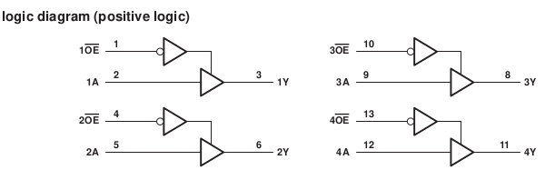

# Archivos Kicad ##

En este directorio debería ir:

## Archivos de proyecto.
## Esquemático.

## PCB.

[Carpeta PCB](MicroSD)

## Modelos  3D.

## Bibliotecas de símbolos y huellas externas (si son necesarios).

[libreria](Libreria)
