#  Proyecto MicroSD

## Información del Proyecto
- **Nombre del diseñador:** Luis Gómez
- **Email:** lgomez@patagones.cl
- **Nombre del proyecto:** PCB microSD
- **Repositorio o drive (url):** https://github.com/cese-dci/tpf24a-cpatagon
- **Esta revisión fue realizada por:** Luis Gómez
- **Fecha de la revisión:** 9/10/2024
- **Fecha último commit:**  Wed Oct 9 19:16:56 2024 -0300
- **Curso CESE - PCB:** DCI24A

## Resumen del PCB

| Característica | Valor |
|----------------|-------|
| Cantidad de capas | 2 |
| Terminación superficial | HASL con Plomo |
| Componentes de un lado o de ambos | Un lado |
| Componentes SMD, TH o mixto | SMD |
| Serigrafía de 1 o de 2 caras | 1 cara |
| Grillas que utilizó | 0,5, 0,25 y 0,1 |
| Valores de anchos de pistas que utilizó | 0,35 y 0,5 |
| Vías/agujeros que utilizó | 0,7/0,3 |
| Clearance (configurado en DRC para regla default) | Sin errores |
| Fabricante| PCB Chile https://pcb-chile.cl/|

## Archivos de proyecto.

### Gerber

Carpeta que contiene los Gerber del proyecto

[Enlace con archivos Gerber](Gerber)

## Esquemático y diagramas

### Esquemático general PCB

Representación completa del circuito de la PCB microSD, mostrando todas las conexiones y componentes principales, incluyendo el buffer 74LVC125A, el regulador AMS117, y el conector de la tarjeta microSD.

Plano  de la placa PCB diseñada se puede ver en la Figura 6 

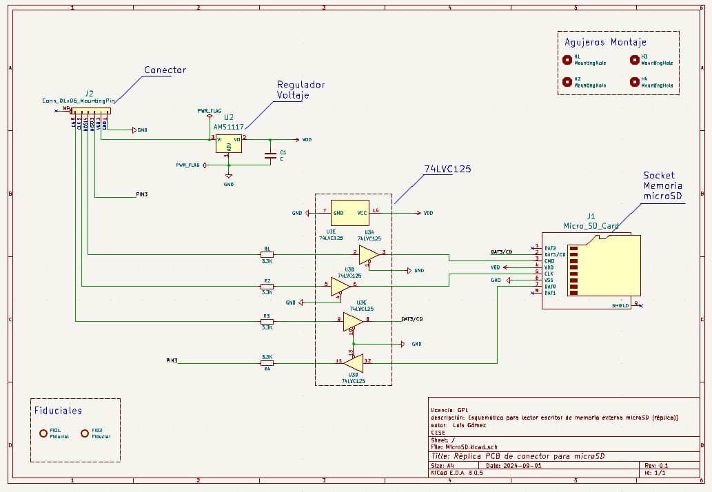

**Figura 1:** Esquemático general de PCB de microSD para mas detalle ver  [link text](PDF/MicroSD.pdf)

### Integrado 74LVC125A
#### Diagrama

Buffer cuádruple de tres estados con entradas tolerantes a 5V. Contiene cuatro buffers independientes con salidas de tres estados, útil para adaptar niveles lógicos y aislar señales en sistemas digitales.

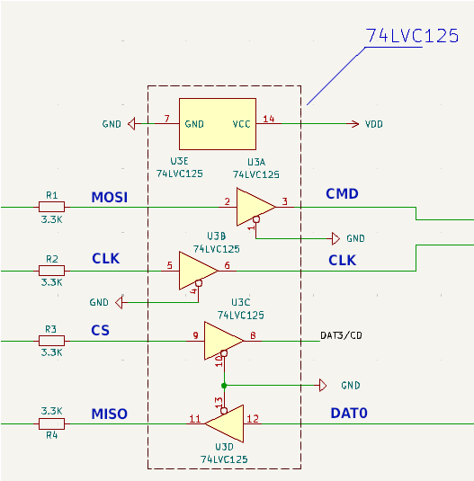

**Figura 2:** Diagrama lógico 74LVC125A 

#### Huella

Patrón de cobre en la PCB para soldar el chip 74LVC125A. Muestra la disposición de los pines y el área necesaria para el montaje del componente en la placa de circuito impreso.

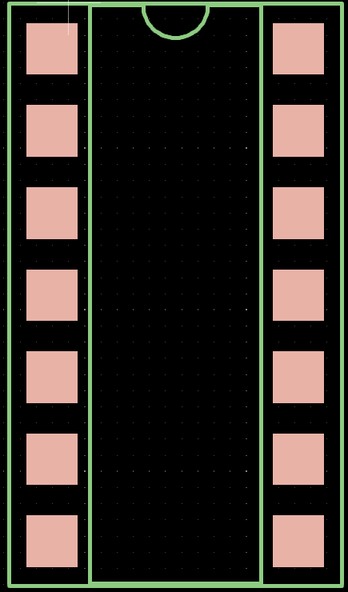

**Figura 4:** Huella integrado 74LVC125A 

### Integrado AMS1117
#### Diagrama

Regulador de voltaje lineal de baja caída. Capaz de proporcionar hasta 1A de corriente de salida con un voltaje de salida ajustable o fijo, comúnmente usado para regular 5V a 3.3V.

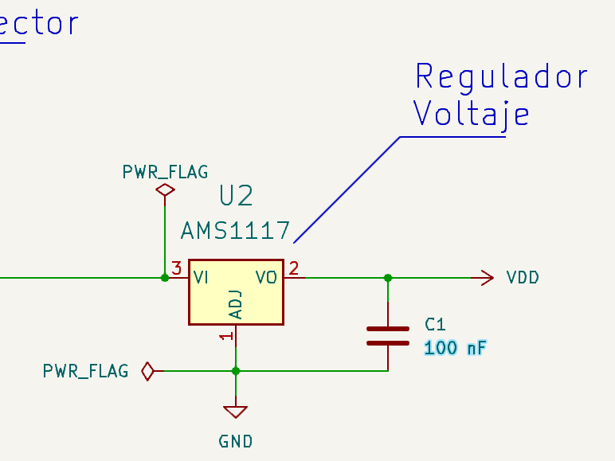

**Figura 5:** Diagrama lógico regulador de voltaje  AMS117 

#### Huella

Patrón de cobre en la PCB para el montaje del regulador AMS117. Muestra la disposición de los pines de entrada, salida y ajuste, así como el área de disipación térmica necesaria.

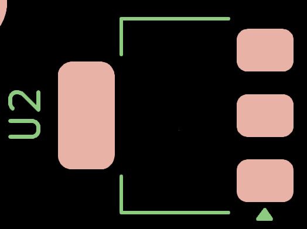

**Figura 5:** Huella AMS117

### Conector microSD

#### Huella 

Patrón de cobre en la PCB para el montaje el conector microSD. Muestra la disposición de los pines de entrada, salida y ajuste.

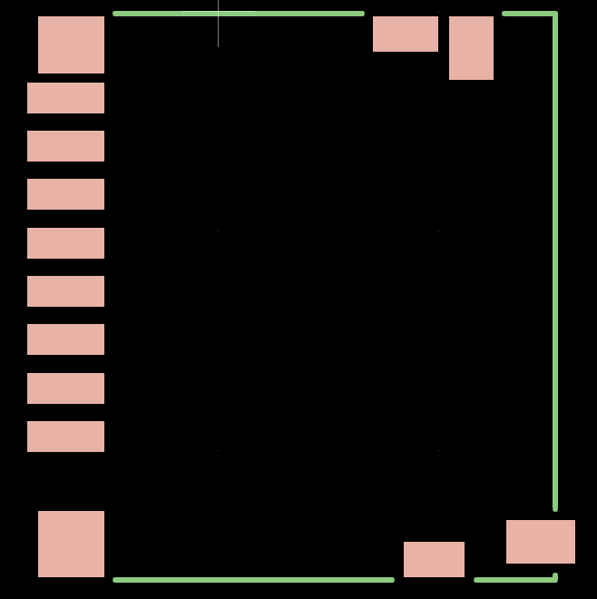

**Figura 6:** Huella conector micro SD

## PCB.

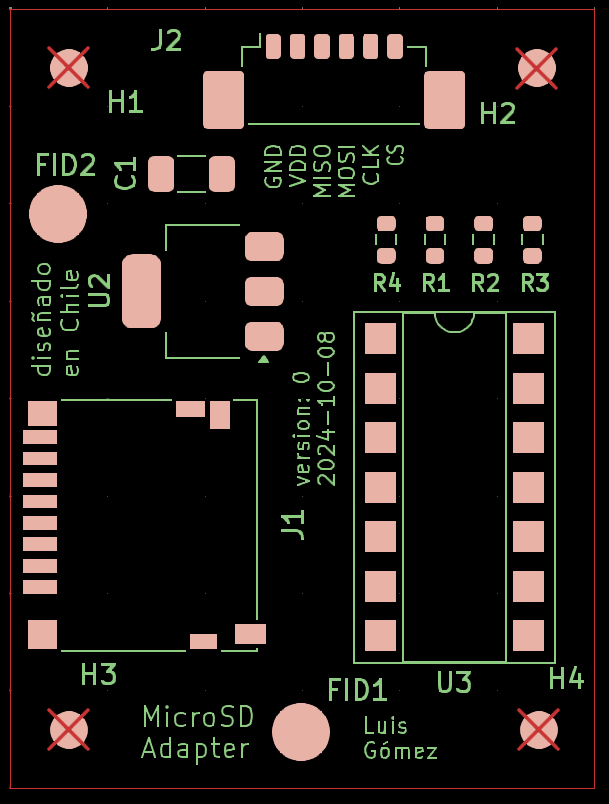
** Figura 2:** Gerber general con las principales huellas de la PCB

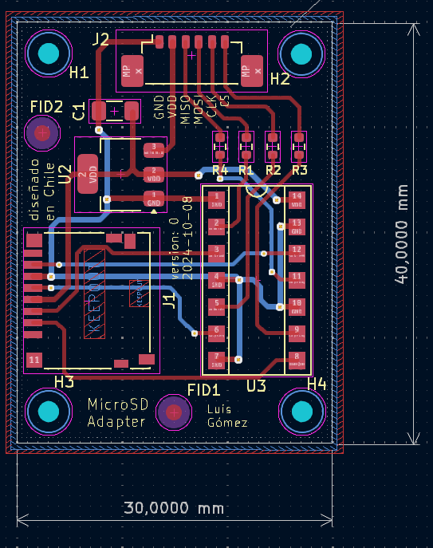
**Figura 6:** Plano  de la placa PCB microSD

[Carpeta PCB](MicroSD)

## Modelos  3D.

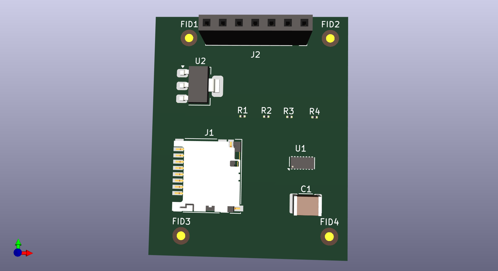

**Figura 7:** Huella Modelo 3D

Los distrintos patrones de cobre para soldar los componentes en la PCB se muestran en la figura 3

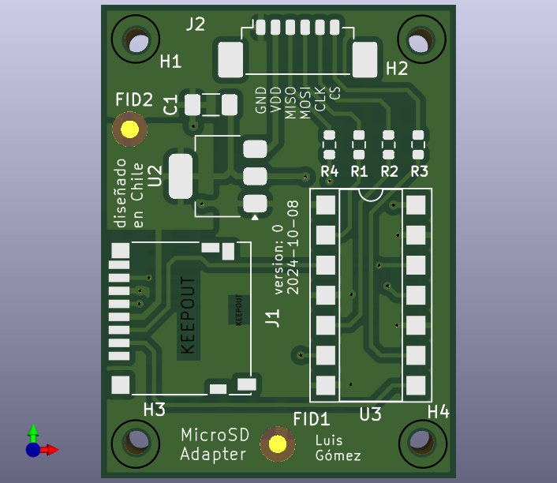

**Figura 3:** Huellas de los distintos componentes en la placa PCB de la microSD diseñada. Mas informacion visitar Gerber: [link text](Gerber/MicroSD-F_Mask.pdf)

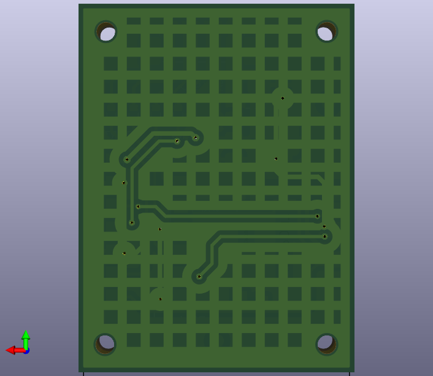

**Figura 7:** Huella Modelo capa secundaria

## Bibliotecas de símbolos y huellas externas (si son necesarios).

[libreria](Libreria)

