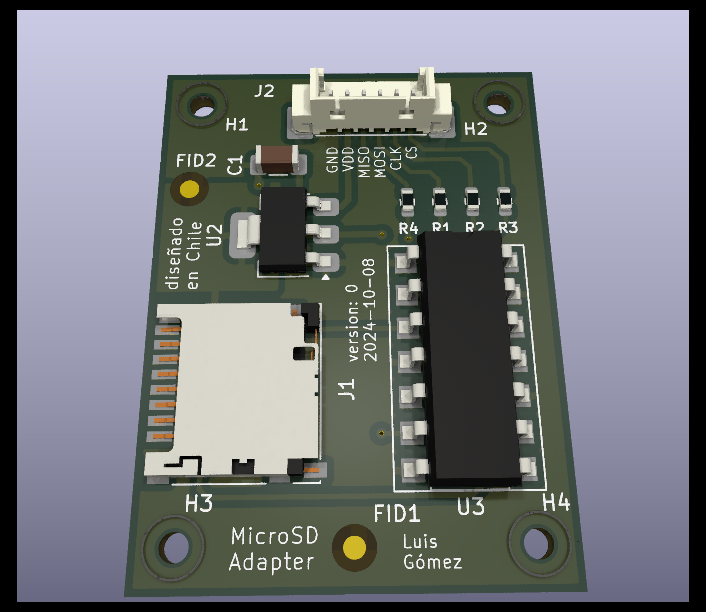

# Proyecto MicroSD: Adaptador PCB

## 1. Información del Proyecto
- **Nombre del diseñador:** Luis Gómez
- **Email:** lgomez@patagones.cl
- **Nombre del proyecto:** PCB microSD
- **Repositorio:** [https://github.com/cese-dci/tpf24a-cpatagon](https://github.com/cese-dci/tpf24a-cpatagon)
- **Revisión realizada por:** Luis Gómez
- **Fecha de la revisión:** 9/10/2024
- **Fecha último commit:** Wed Oct 9 19:16:56 2024 -0300
- **Curso CESE - PCB:** DCI24A

## 2. Resumen Ejecutivo
Este proyecto consiste en el diseño de un adaptador PCB para tarjetas MicroSD, destinado a facilitar la integración de almacenamiento externo en sistemas embebidos. El diseño se enfoca en la compatibilidad con interfaces de 3.3V y 5V, utilizando componentes SMD para minimizar el tamaño y mejorar el rendimiento.

## 3. Especificaciones Técnicas del PCB

| Característica | Valor |
|----------------|-------|
| Cantidad de capas | 2 |
| Terminación superficial | HASL con Plomo |
| Disposición de componentes | Un lado |
| Tecnología de componentes | SMD |
| Serigrafía | 1 cara |
| Grillas utilizadas | 0,5 mm, 0,25 mm, 0,1 mm |
| Anchos de pistas | 0,35 mm y 0,5 mm |
| Vías/agujeros | 0,7 mm / 0,3 mm |
| Clearance (DRC default) | Sin errores |
| Fabricante | [PCB Chile](https://pcb-chile.cl/) |

## 4. Componentes Principales

### 4.1 Integrado 74LVC125A
- **Función:** Buffer cuádruple de tres estados con entradas tolerantes a 5V.
- **Aplicación:** Adaptación de niveles lógicos y aislamiento de señales.
- **Diagrama:**

    
  *Figura 1: Diagrama lógico 74LVC125A*

- **Huella:**

    
  *Figura 2: Huella del integrado 74LVC125A*

### 4.2 Regulador AMS1117
- **Función:** Regulador de voltaje lineal de baja caída.
- **Especificaciones:** Hasta 1A de corriente de salida, comúnmente usado para regular 5V a 3.3V.
- **Diagrama:**

    
  *Figura 3: Diagrama lógico del regulador AMS1117*

- **Huella:**

    
  *Figura 4: Huella del regulador AMS1117*

### 4.3 Conector MicroSD
- **Función:** Interfaz física para la tarjeta MicroSD.
- **Diagrama:**

    
  *Figura 5: Diagrama del conector MicroSD*

- **Huella:**

    
  *Figura 6: Huella del conector MicroSD*

## 5. Diseño del PCB

### 5.1 Esquemático General
  
*Figura 7: Esquemático general de la PCB MicroSD*

Para más detalles, consulte el [PDF del esquemático completo](PDF/MicroSD.pdf).

### 5.2 Vista General del PCB
  
*Figura 8: Vista general de la PCB para MicroSD*

### 5.3 Huellas de Componentes en PCB
  
*Figura 9: Gerber general con las principales huellas de la PCB*

## 6. Modelos 3D

### 6.1 Vista General 3D
  
*Figura 10: Vista general del modelo 3D de la PCB MicroSD*

### 6.2 Vista Frontal 3D
  
*Figura 11: Vista frontal del modelo 3D con huellas de componentes*

### 6.3 Vista Trasera 3D
  
*Figura 12: Vista trasera del modelo 3D*

## 7. Archivos del Proyecto

### 7.1 Archivos Gerber
Los archivos Gerber necesarios para la fabricación se encuentran en la [carpeta Gerber](Gerber).

### 7.2 Archivos de PCB
Los archivos de diseño de PCB se encuentran en la [carpeta PCB](MicroSD).

### 7.3 Bibliotecas de Símbolos y Huellas
Las bibliotecas personalizadas utilizadas en este proyecto se encuentran en la [carpeta Libreria](Libreria).

## 8. Consideraciones de Diseño
- Se utilizó un enfoque de ruteo de dos capas para optimizar el espacio y reducir la interferencia electromagnética.
- Se implementaron planos de tierra en ambas capas para mejorar el manejo de EMI.
- Las pistas de datos se diseñaron con impedancia controlada para mantener la integridad de la señal a altas velocidades.

## 9. Próximos Pasos
- Fabricación de prototipos para pruebas y validación.
- Realización de pruebas de funcionamiento a diferentes voltajes (3.3V y 5V).
- Análisis térmico bajo carga máxima.
- Consideración de mejoras para futuras versiones, como la integración de un controlador USB o soporte para velocidades UHS-I.

## 10. Conclusiones
Este diseño de PCB para adaptador MicroSD ofrece una solución compacta y versátil para la integración de almacenamiento externo en sistemas embebidos, con consideraciones especiales para la compatibilidad de voltajes y el rendimiento de alta velocidad.
